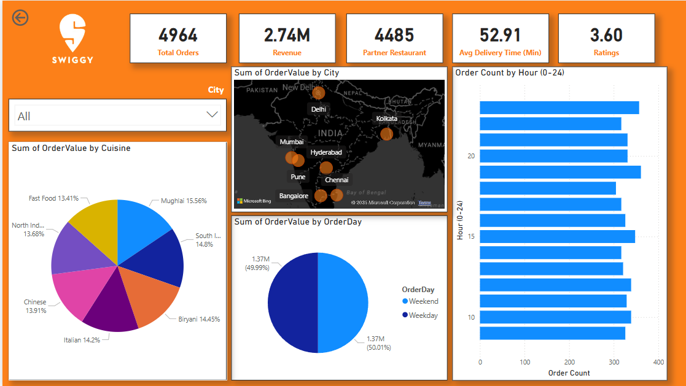
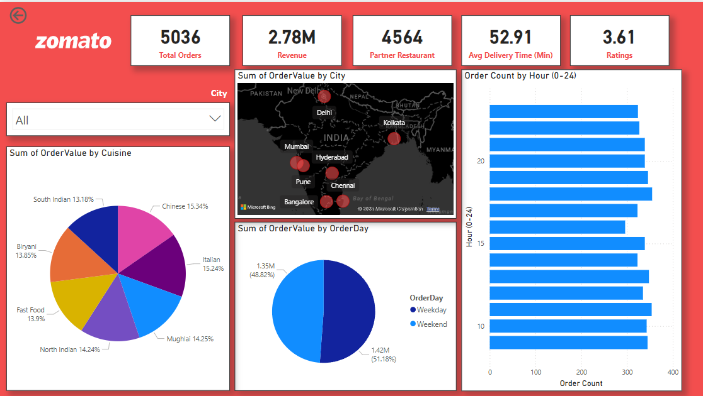

# 🍽️ Swiggy vs Zomato: Competitive Intelligence Dashboard

<p align="center">
  
</p>

<p align="center">
  
  
  
</p>

---

## 📖 Project Overview

The **Swiggy vs Zomato: Competitive Intelligence Dashboard** is an interactive Power BI project that compares the performance of India's two largest food delivery platforms.

The dashboard transforms food delivery data into actionable business insights by analyzing:

✅ Order Volume  
✅ Revenue Performance  
✅ Restaurant Partnerships  
✅ Customer Ratings  
✅ Delivery Efficiency  
✅ Cuisine Preferences  
✅ City-wise Demand Distribution  
✅ Hourly Ordering Trends  

This project demonstrates how Business Intelligence can be used to evaluate market competition and customer behavior in the food delivery industry.

---

## 🎯 Business Problem

The online food delivery market is highly competitive.

Companies need answers to questions such as:

- Which platform generates higher revenue?
- Which platform has more active customers?
- What cuisines are most popular?
- Which cities contribute the highest sales?
- When do customers order food the most?
- How do weekend and weekday orders differ?

Without a centralized dashboard, these insights are difficult to identify and analyze.

---

## 🎯 Project Goal

The goal of this dashboard is to:

- Compare Swiggy and Zomato performance
- Analyze customer ordering behavior
- Identify revenue-generating locations
- Understand cuisine demand patterns
- Discover peak ordering hours
- Support strategic business decisions

---

# 🛠️ Tech Stack

| Tool | Purpose |
|--------|---------|
| 📊 Power BI Desktop | Dashboard Development |
| 🔄 Power Query | Data Cleaning & Transformation |
| 🧠 DAX | Calculated Measures & KPIs |
| 🗂️ Data Modeling | Relationship Building |
| 📍 Bing Maps | Geographical Visualization |
| 📁 Excel | Dataset Storage |

---

# 📂 Dataset Information

The dataset contains:

- Order Details
- Revenue Data
- Partner Restaurants
- Customer Ratings
- Delivery Time Metrics
- Cuisine Categories
- City Information
- Hourly Order Trends
- Weekday vs Weekend Orders

> **Note:** This project uses simulated data for educational and portfolio purposes only.

---

# 🏠 Dashboard Navigation

The dashboard contains three pages:

## 1️⃣ Home Page

Interactive landing page for dashboard navigation.

### Features

- Swiggy Dashboard Button
- Zomato Dashboard Button
- Platform Comparison Interface

<p align="center">
  
</p>

---

## 🟠 Swiggy Dashboard

### KPI Summary

| KPI | Value |
|------|--------|
| Total Orders | 4,964 |
| Revenue | ₹2.74M |
| Partner Restaurants | 4,485 |
| Avg Delivery Time | 52.91 Min |
| Ratings | 3.60 |

### Dashboard Features

### 📍 Revenue by City
Visualizes revenue contribution from major Indian cities.

### 🍛 Cuisine Analysis
Shows customer food preferences.

- Fast Food
- Mughlai
- South Indian
- Biryani
- Italian
- Chinese
- North Indian

### 📅 Weekday vs Weekend Orders
Compares order volume between weekdays and weekends.

### ⏰ Hourly Order Trends
Identifies peak ordering hours throughout the day.

<p align="center">
  
</p>

---

## 🔴 Zomato Dashboard

### KPI Summary

| KPI | Value |
|------|--------|
| Total Orders | 5,036 |
| Revenue | ₹2.78M |
| Partner Restaurants | 4,564 |
| Avg Delivery Time | 52.91 Min |
| Ratings | 3.61 |

### Dashboard Features

### 📍 Revenue by City
City-wise revenue analysis.

### 🍛 Cuisine Distribution
Popular cuisines ordered through Zomato.

### 📅 Weekday vs Weekend Analysis
Customer behavior across weekdays and weekends.

### ⏰ Hourly Order Analysis
Tracks food ordering activity throughout the day.

<p align="center">
  
</p>

---

# 📊 Competitive Analysis

| Metric | Swiggy | Zomato | Winner |
|----------|----------|----------|----------|
| Orders | 4,964 | 5,036 | 🏆 Zomato |
| Revenue | ₹2.74M | ₹2.78M | 🏆 Zomato |
| Restaurants | 4,485 | 4,564 | 🏆 Zomato |
| Delivery Time | 52.91 Min | 52.91 Min | 🤝 Tie |
| Ratings | 3.60 | 3.61 | 🏆 Zomato |

---

# 🔍 Key Insights

### 📈 Business Insights

- Zomato slightly outperforms Swiggy in total revenue.
- Zomato has a larger restaurant network.
- Customer ratings are nearly identical.
- Weekend orders contribute significantly to revenue.
- Major metro cities dominate order volume.
- Food preferences remain consistent across both platforms.
- Peak order demand occurs during lunch and dinner hours.

---

# 💼 Business Impact

This dashboard can help:

### 🍴 Restaurants

- Select the most suitable delivery platform.
- Understand customer food preferences.

### 📢 Marketing Teams

- Launch targeted city-specific campaigns.
- Optimize promotion timing.

### 🚚 Operations Teams

- Improve delivery efficiency.
- Manage high-demand periods.

### 📊 Business Analysts

- Track competitive performance.
- Generate actionable recommendations.

---

# 📁 Repository Structure

```text
Swiggy-vs-Zomato-Competitive-Intelligence-Dashboard
│
├── Dataset
│   ├── food.xlsx
│   ├── orders.xlsx
│   └── restaurant.xlsx
│
├── Dashboard
│   └── Swiggy Vs Zomato Report.pbit
│
├── Screenshots
│   ├── Home Page.png
│   ├── Swiggy.png
│   └── Zomato.png
│
└── README.md
```

---

# 🚀 How to Run

### Step 1

Clone the repository:

```bash
git clone https://github.com/yourusername/Swiggy-vs-Zomato-Competitive-Intelligence-Dashboard.git
```

### Step 2

Open the `.pbit` file using Power BI Desktop.

### Step 3

Connect the Excel datasets.

### Step 4

Refresh the data model.

### Step 5

Explore the dashboard and insights.

---

# 🌟 Future Enhancements

- Customer Segmentation Analysis
- Profitability Analysis
- Restaurant Performance Tracking
- Delivery Partner Analytics
- Customer Sentiment Analysis
- Predictive Demand Forecasting
- Real-Time Dashboard Integration

---

# 👨‍💻 Author

### Vishal Gupta

**Aspiring Data Analyst | Power BI Developer | SQL Enthusiast**

### Skills

- Power BI
- SQL
- Python
- Excel
- Data Visualization
- Business Intelligence
- Data Analytics

📧 Email: vishalg9621@gmail.com   


---

## ⭐ If you found this project useful, don't forget to star the repository!
